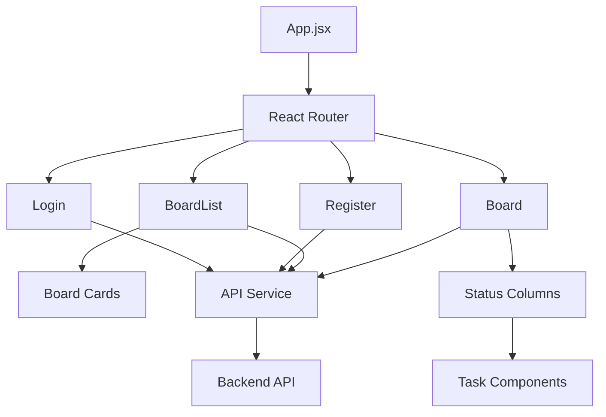
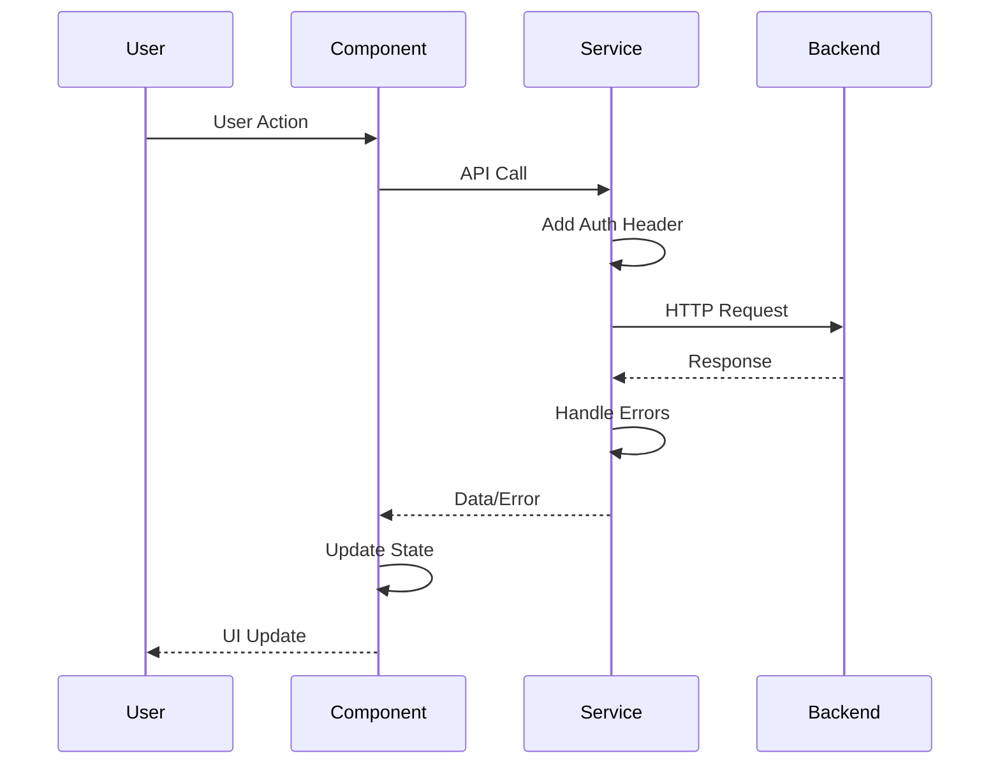
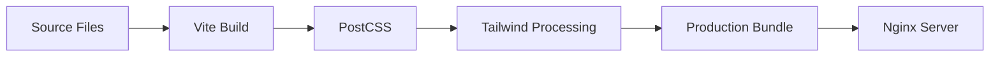

# Architecture Documentation

## File and Directory Structure

```
openflow-frontend/
├── src/
│   ├── components/              # React components
│   │   ├── Board.jsx           # Board view with status columns
│   │   ├── BoardList.jsx       # List of user boards
│   │   ├── Login.jsx           # Login form
│   │   ├── Register.jsx        # Registration form
│   │   └── Task.jsx            # Task card component
│   ├── services/               # API and utility services
│   │   └── api.js              # Axios instance with interceptors
│   ├── App.jsx                 # Main application component
│   ├── main.jsx                # Application entry point
│   └── index.css               # Global styles and Tailwind imports
├── public/                     # Static assets
├── index.html                  # HTML template
├── package.json                # Dependencies and scripts
├── vite.config.js             # Vite configuration
├── tailwind.config.js          # Tailwind CSS configuration
├── postcss.config.js           # PostCSS configuration
├── nginx.conf                  # Nginx configuration for production
├── Dockerfile                  # Container build definition
└── docs/                       # Documentation
```

## Component Architecture



## Component Hierarchy

```
App
├── Login (Route)
├── Register (Route)
├── BoardList (Protected Route)
│   └── Board Cards
└── Board (Protected Route)
    ├── Status Columns
    │   └── Tasks
    └── Modals
        ├── Create Status Form
        └── Create Task Form
```

## Data Flow



## State Management

- **Local State**: Component-level state using `useState`
- **URL State**: Route parameters and navigation
- **Persistent State**: LocalStorage for authentication tokens
- **Server State**: Fetched via API calls

## Routing Structure

- `/login` - Authentication page
- `/register` - User registration
- `/boards` - Board list (protected)
- `/boards/:id` - Individual board view (protected)
- `/` - Redirects to `/boards`

## Styling Architecture

- **Tailwind CSS**: Utility-first CSS framework
- **Custom CSS**: Global styles and utilities in `index.css`
- **Responsive Design**: Mobile-first breakpoints
- **Theme**: Custom color palette defined in `tailwind.config.js`

## API Integration

- **Base URL**: Configurable via environment variables
- **Authentication**: JWT tokens in Authorization header
- **Error Handling**: Centralized in Axios interceptors
- **Request/Response**: JSON format

## Build Process



## Component Responsibilities

### App.jsx
- Route configuration
- Protected route wrapper
- Application-level providers

### BoardList.jsx
- Fetch and display user boards
- Create new boards
- Navigate to board details

### Board.jsx
- Display board with status columns
- Manage statuses and tasks
- Handle drag and drop
- Coordinate task operations

### Task.jsx
- Display task card
- Handle task editing
- Support drag and drop
- Task deletion

### Login/Register.jsx
- User authentication forms
- Form validation
- Error handling
- Token storage

## Service Layer

### api.js
- Axios instance configuration
- Request/response interceptors
- Token management
- Error handling
- Base URL configuration


