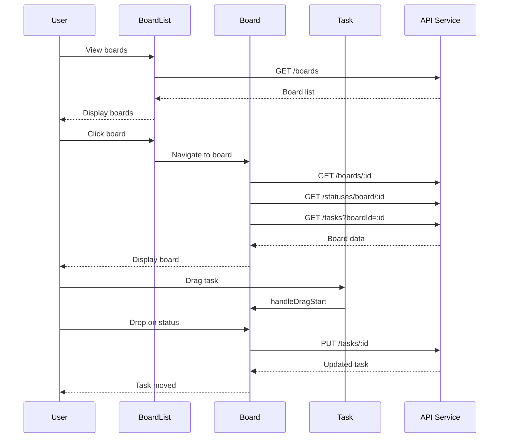

# Component API Documentation

## Components

### App

Main application component handling routing and authentication.

**Props**: None

**Routes**:
- `/login` - Login page
- `/register` - Registration page
- `/boards` - Board list (protected)
- `/boards/:id` - Board view (protected)

**Protected Routes**: Routes wrapped with `PrivateRoute` require authentication.

### Login

Authentication form component.

**Props**: None

**State**:
- `username` (string)
- `password` (string)
- `error` (string)

**Methods**:
- `handleSubmit(e)` - Handles form submission, calls API, stores token

**API Calls**:
- `POST /api/auth/login`

### Register

User registration form component.

**Props**: None

**State**:
- `username` (string)
- `email` (string)
- `password` (string)
- `error` (string)

**Methods**:
- `handleSubmit(e)` - Handles registration, calls API, stores token

**API Calls**:
- `POST /api/auth/register`

### BoardList

Displays list of user boards with creation and management capabilities.

**Props**: None

**State**:
- `boards` (array) - List of board objects
- `showCreateForm` (boolean) - Form visibility
- `newBoardName` (string)
- `newBoardDescription` (string)
- `showUserMenu` (boolean) - User menu visibility

**Methods**:
- `fetchBoards()` - Fetches boards from API
- `handleCreateBoard(e)` - Creates new board
- `handleDeleteBoard(id)` - Deletes board
- `handleLogout()` - Logs out user

**API Calls**:
- `GET /api/boards`
- `POST /api/boards`
- `DELETE /api/boards/:id`

### Board

Displays board with status columns and tasks. Handles drag and drop.

**Props**: None (uses route parameter `id`)

**State**:
- `board` (object) - Current board data
- `statuses` (array) - Status columns
- `tasks` (array) - All tasks in board
- `showStatusForm` (boolean)
- `showTaskForm` (boolean)
- `selectedStatusId` (number)
- `draggedTaskId` (number)
- `dragOverStatusId` (number)

**Methods**:
- `fetchBoard()` - Fetches board data
- `fetchStatuses()` - Fetches status columns
- `fetchTasks()` - Fetches tasks
- `handleCreateStatus(e)` - Creates status column
- `handleDeleteStatus(id)` - Deletes status
- `handleCreateTask(e)` - Creates task
- `handleDeleteTask(id)` - Deletes task
- `handleUpdateTask(id, data)` - Updates task
- `handleDragStart(taskId)` - Initiates drag
- `handleDragEnd()` - Ends drag
- `handleDragOver(e, statusId)` - Handles drag over
- `handleDrop(e, statusId)` - Handles drop

**API Calls**:
- `GET /api/boards/:id`
- `GET /api/statuses/board/:boardId`
- `GET /api/tasks?boardId=:id`
- `POST /api/statuses`
- `DELETE /api/statuses/:id`
- `POST /api/tasks`
- `PUT /api/tasks/:id`
- `DELETE /api/tasks/:id`

### Task

Displays individual task card with edit and delete capabilities.

**Props**:
- `task` (object) - Task data
- `onDelete(id)` - Delete callback
- `onUpdate(id, data)` - Update callback
- `onDragStart(id)` - Drag start callback
- `onDragEnd()` - Drag end callback

**State**:
- `isEditing` (boolean)
- `title` (string)
- `description` (string)

**Methods**:
- `handleSave()` - Saves edited task
- `handleCancel()` - Cancels editing
- `handleDragStart(e)` - Handles drag start
- `handleDragEnd(e)` - Handles drag end

## Services

### api.js

Axios instance with interceptors for authentication and error handling.

**Exports**:
- `default` - Configured Axios instance

**Configuration**:
- Base URL: `/api` (production) or `http://localhost:8080/api` (development)
- Request interceptor: Adds JWT token to headers
- Response interceptor: Handles 401/403 errors, redirects to login

**Methods**:
- Standard Axios methods (get, post, put, delete)

## Component Interaction Flow



## Props Interface

### Task Props
```javascript
{
  task: {
    id: number,
    title: string,
    description: string,
    statusId: number,
    boardId: number,
    createdAt: string
  },
  onDelete: (id: number) => void,
  onUpdate: (id: number, data: object) => void,
  onDragStart: (id: number) => void,
  onDragEnd: () => void
}
```

## Event Handlers

### Drag and Drop Events
- `onDragStart` - Fired when drag begins
- `onDragOver` - Fired while dragging over target
- `onDragLeave` - Fired when leaving target
- `onDrop` - Fired when drop occurs

### Form Events
- `onSubmit` - Form submission
- `onChange` - Input value changes
- `onClick` - Button clicks

## State Management Patterns

### Local State
- Component-specific state using `useState`
- Form state managed locally
- UI state (modals, menus) managed locally

### URL State
- Route parameters via `useParams`
- Navigation via `useNavigate`

### Persistent State
- Authentication tokens in `localStorage`
- Username in `localStorage`

## Error Handling

### API Errors
- Handled in Axios interceptors
- 401/403: Clear token, redirect to login
- Other errors: Display error message

### Component Errors
- Try-catch blocks in async functions
- Error state for user feedback
- Console logging for debugging


