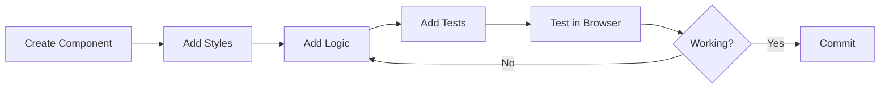
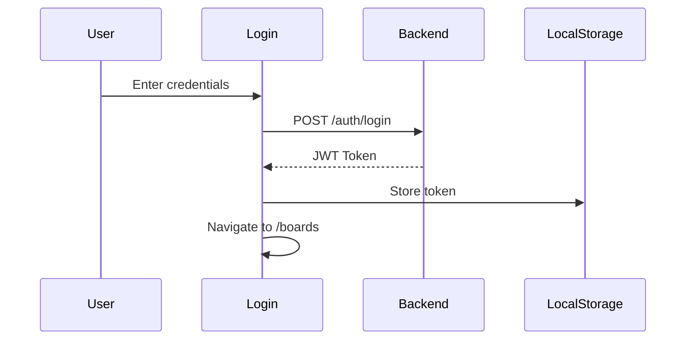
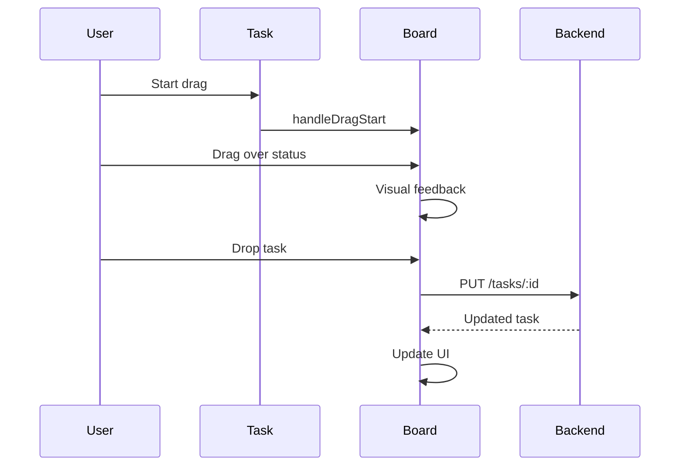

# Common Workflows

## Development Workflow

### Setting Up Development Environment

1. Clone repository
2. Build container image
3. Run container with volume mount
4. Access application at http://localhost:3000
5. Make changes (hot reload enabled)

### Making Changes

1. Create feature branch
2. Implement changes following coding standards
3. Write tests for new functionality
4. Test in browser
5. Run tests in container
6. Commit with conventional commit format
7. Push and create pull request

### Component Development Workflow



## Common Tasks

### Creating a New Component

1. Create component file in `src/components/`
2. Add component logic and state
3. Create styles using Tailwind
4. Add component to parent
5. Write tests
6. Update documentation

### Adding a New Route

1. Define route in `App.jsx`
2. Create component for route
3. Add navigation links
4. Test routing
5. Add protected route wrapper if needed

### Integrating API Endpoint

1. Review backend API documentation
2. Add API call in service or component
3. Handle loading state
4. Handle error state
5. Update UI with response
6. Test integration

### Styling Components

1. Use Tailwind utility classes
2. Add custom classes if needed
3. Ensure responsive design
4. Test on different screen sizes
5. Verify accessibility

## User Workflows

### Authentication Flow



### Board Creation Flow

1. User clicks "Create Board"
2. Form appears
3. User enters name and description
4. Form submits to API
5. New board created
6. User redirected to board view

### Task Management Flow

1. User selects board
2. Status columns load
3. User creates task in status
4. Task appears in column
5. User can drag task to other status
6. Task updates on server

### Drag and Drop Flow



## Build and Deployment Workflow

### Development Build

1. Run `npm run dev`
2. Vite starts dev server
3. Changes trigger HMR
4. Browser updates automatically

### Production Build

1. Run `npm run build`
2. Vite creates optimized bundle
3. Files output to `dist/`
4. Build tested locally
5. Container image built
6. Image pushed to registry

### Container Deployment

1. Build image: `podman build -t openflow-frontend:latest .`
2. Test image locally
3. Tag for registry
4. Push to registry
5. Deploy using `kube.yaml`

## Testing Workflow

### Writing Tests

1. Create test file next to component
2. Write test cases
3. Mock API calls
4. Test user interactions
5. Test edge cases
6. Run tests in container

### Running Tests

```bash
# Build test container
podman build -f Dockerfile.test -t frontend-test .

# Run tests
podman run --rm frontend-test npm test

# Run with coverage
podman run --rm frontend-test npm test -- --coverage
```

## Integration Workflow

### Backend Integration

1. Ensure backend is running
2. Configure API base URL
3. Test API connectivity
4. Verify CORS settings
5. Test authentication flow
6. Test all endpoints

### Deployment Integration

1. Coordinate with deployment repository
2. Update `kube.yaml` if needed
3. Test full stack deployment
4. Verify environment variables
5. Test production build

## Troubleshooting Workflow

### Application Won't Start

1. Check container logs
2. Verify port availability
3. Check environment variables
4. Verify build succeeded
5. Check browser console

### API Connection Issues

1. Verify backend is running
2. Check API base URL
3. Verify CORS configuration
4. Check network tab in browser
5. Verify token is valid

### Build Failures

1. Check Node.js version
2. Clear node_modules
3. Clear build cache
4. Rebuild container
5. Check error messages

### Styling Issues

1. Verify Tailwind is configured
2. Check PostCSS configuration
3. Verify CSS imports
4. Check browser DevTools
5. Test responsive breakpoints

## Performance Optimization

### Bundle Size

1. Analyze bundle: `npm run build -- --analyze`
2. Identify large dependencies
3. Consider code splitting
4. Lazy load routes
5. Optimize images

### Runtime Performance

1. Use React.memo for expensive components
2. Optimize re-renders
3. Use useCallback for handlers
4. Debounce API calls if needed
5. Monitor performance metrics

